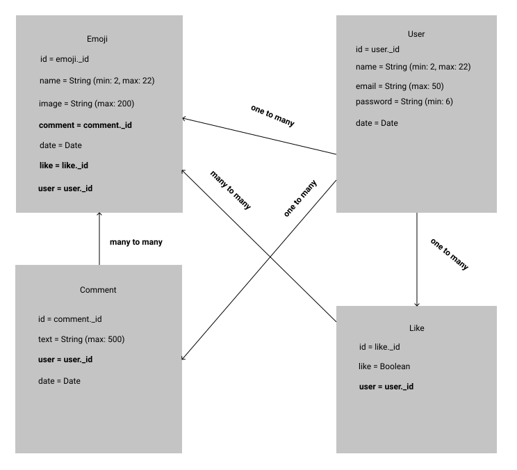
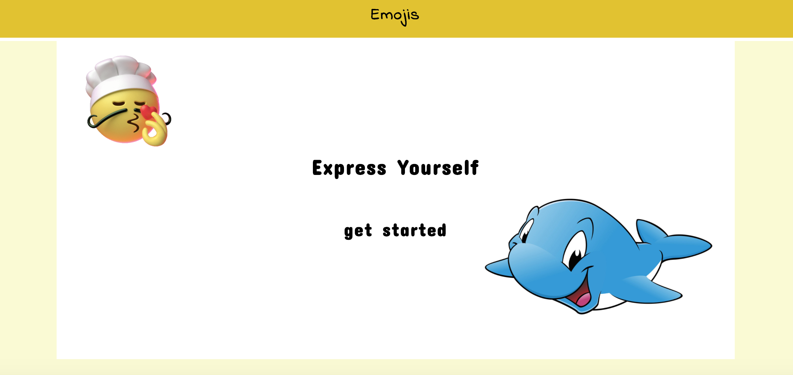
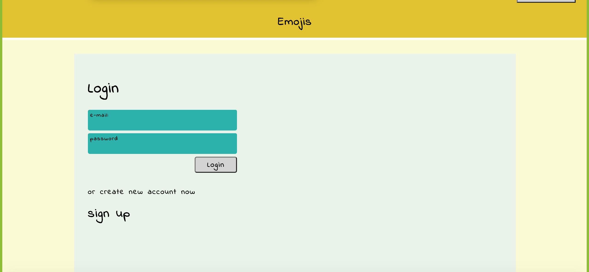
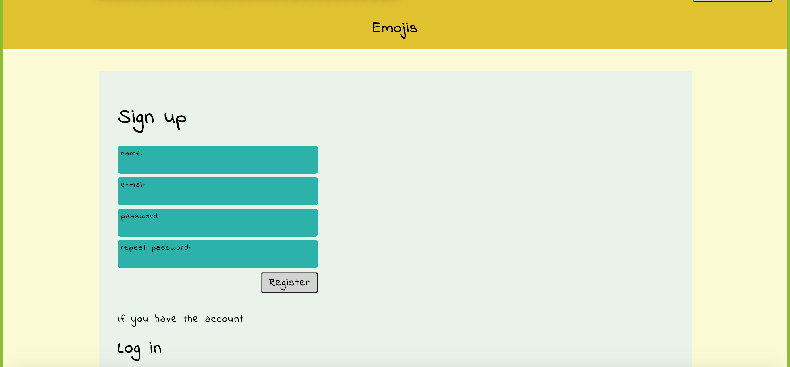
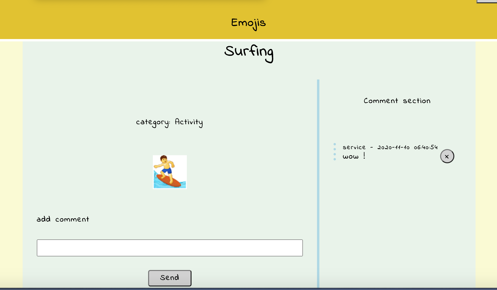

## Emojis - Express yourself
This is a Django API and full-stack web application with a relational database to allow users to comment and like their favourite emojis.
## Timeframe
8 days
## Goal
To produce a full-stack web application using Python, Django, React, and CSS.
## Technologies
- React, lifecycle methods
- Django, rest_framework
- JSON web token
## Install dependencies
```
1. pipenv install shell
2. pipenv shell
# run app
3. python manage.py runserver
```
## Usage
* Django provides an admin site on the address <i>localhost:8000/admin</i>.
You can create the account using the command below.
```
# Create the admin account
python manage.py createsuperuser
```
* Update database setup to your own
This project uses a PostgreSQL database structure. Follow the project/settings.py to update it on your own.
```
DATABASES = {
'default': {
    'ENGINE': 'django.db.backends.postgresql_psycopg2',
    'NAME': 'emojis-django',
    'HOST': 'localhost',
    'PORT': 5432
}
}
```
## Subjects
* User authentication,
* Use model database relationships,
* Add emoji comments
* Style components using CSS
## License
* Version 1.0.0
* License MIT
* Created by Puja
## Django initial process
This application has been created based on python Django back-end with rest_framework. Please follow the description below.
* Install python framework dependencies.
Firstly is to follow the commands to build the Django-template. Steps include installing the environment to work on the framework Django. In this project, we use the pip environment.
```
# initialize the environment:
pip install pipenv
# Install the env shell to work based on the environment:
pipenv install shell
# connect with the environment shell in your terminal:
pipenv shell
```
Install pylint to inform VS Code about the changes.
```
pipenv install pylint
```
* Install database project
```
pipenv install psycopg2-binary
# create a database manually:
created db-name
```
* Initial the models’ migrations
Run the migration to initialize the application setup.
```
python manage.py migrate
```
* Create the project files
Run the command to create the project directory
```
Django-admin startup project
```
* Django setup is complete.
The development process came to the step of expanding the features.
## Development process
## I. Back-end site - server
<i>This section is about the features and also the challenges of app development.</i>
* Create the back-end features
The process of features development includes the structures of emojis, user authentication, likes, and comments.
Every implemented feature was imported into <i>project/settings.py</i> directory.
```
INSTALLED_APPS = [
  'django.contrib.admin',
  'django.contrib.auth',
  'django.contrib.contenttypes',
  'django.contrib.sessions',
  'django.contrib.messages',
  'django.contrib.staticfiles',
  'rest_framework',
  'jwt_auth',
  'emojis',
  'comments',
  'likes',
]
AUTH_USER_MODEL = 'jwt_auth.User'
```
To get every created model, please navigate the app folder.
To introduce you to the sentence I present an example below.
```
# an example of the model - comments/models.py
from Django.db import models
from jwt_auth.models import Users
from emojis. models import Emoji
class Comment(models.Model):
text = models.CharField(max_length=500)
user = models.ForeignKey(User, on_delete=models.CASCADE)
date = models.DateTimeField(auto_now_add=True)
emoji = models.ForeignKey(Emoji, default=False, on_delete=models.CASCADE)
 def __str__(self):
  return f'{self.text}'
```
In this example, we can see the foreignKey of Emoji. It defines the relations between those models.
Comment model storage <i>the Emojis id</i> to identificate with the Emoji model.

This is a graphic representation of model relationships.
## II. Front-end site - User interface
The goal was to fit the user interface to the potential user expectations.
The front part of the project is built with a react app in the frontend/ directory.

* Files structure.
Files inside the project are selected in groups.
```
Public
Styles - CSS
Components
Authentication
Actions - db requests
Utils - helpful function directory
```
* API actions
The <i>actions/</i> directory includes the groups of CRUD requests - create, read, update, delete.
* Styles
User interface has been created with CSS. Files are contained in <i>styles/</i> directory.
* Authentication
Login and register forms are in auth/ directory


Once the user is authorized successfully then the user goes to the next page as loggedIn.
Once the user logs out then the status of the logged user comes to the false.
Authentication functions directory
```
/ set token into the local storage
export const login = async(formData, history) => {
 const config = {
   headers: {
     'Content-Type': 'application/json'
   }
 }
 try {
   const res = await axios.post('/api/auth/login/', formData, config)
  
   if (res.data) {
     await localStorage.setItem('token', res.data.token)
 
   }
   console.log('user logged in')
   history.push('/')
  
   return res.data
 } catch (err) {
   return { error: 'Invalid credentials.' }
 }
}
export const register = async(formData, history) => {
 const config = {
   headers: {
     'Content-Type': 'application/json'
   }
 }
 try {
   const res = await axios.post('/api/auth/register/', formData, config)
 
 
   history.push('/')
 
   console.log('hello user')
   return res.data
 } catch (err) {
   return { error: 'User already exists.' }
 }
}
// remove token from the local storage
export const logout = async(history) => {
  await localStorage.removeItem('token')
 
 /* setHeader() */
 console.log('user logged out')
 return history.push('/')
}
export const getUsers = async() => {
 const res = await axios.get('/api/auth')
  return res.data
}
```
Log out function
```
# remove token from the local storage
export const logout = async(history) => {
 await localStorage.removeItem('token')
return history.push('/')
}
```
* Comments section
Users can add the comment on the emojis page.

## Future development
 
The next part of the development process is to add more features. Such as user functionalities: add emojis, likes / unlike emojis. Animate frontend elements and make it smoother.
 
 
